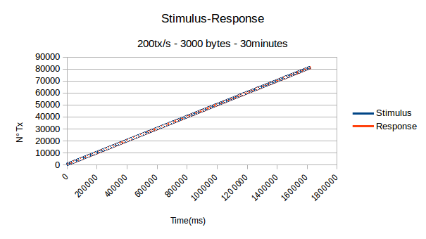
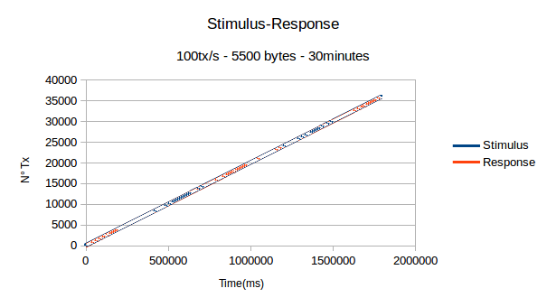
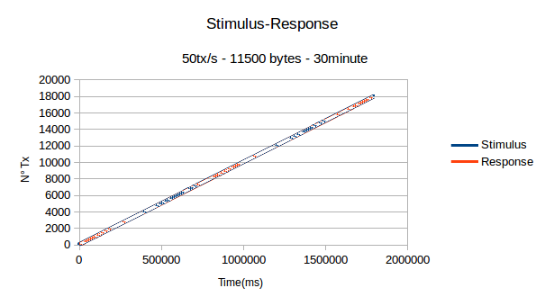
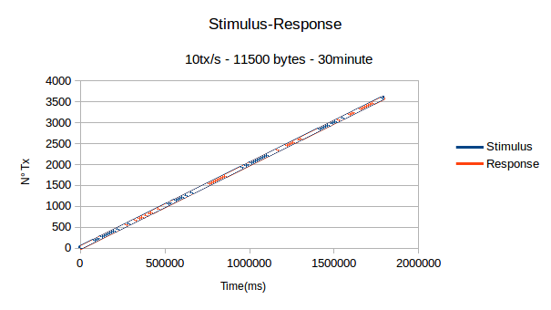
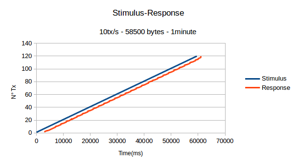
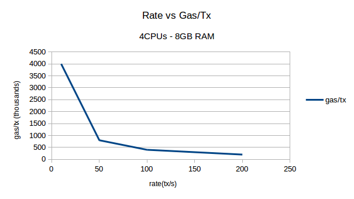
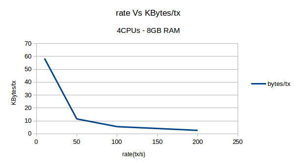

## TRANSACTIONS PER SECOND RATE TEST IN PANTHEON NETWORK ##
### PURPOSE ###
<p>Determine how much transactions (with and without data), can be stored on each block
</p>
<p> Establish limitations of Pantheon when it is exposed to a stress test.</p>
<p>To achieve this goal a testing network of two nodes where configured with the following configuration (similar configuration to Lacchain) :</p>

1. 4 vCPUs, 15 GB memory

3. Genesis details:
```shell
{
    "config" : {
            "chainId" : 2018,
            "constantinoplefixblock" : 0,
            "ibft2" : {
            "blockperiodseconds" : 2,
            "epochlength" : 30000,
            "requesttimeoutseconds" : 4
            }
    },
    "nonce" : "0x0",
    "timestamp" : "0x58ee40ba",
    "gasLimit" : ** "0x2FEFD800" **,
    .
    .
    .
}
```

### GENERAL KNOWLEDGE ###
1. Gas
2. Data with transactions
3. Block Period Seconds
4. Gas Limit

### TERMINOLOGY ###
1. Stimulus: Transactions that are sent to a node in a period of time at some rate(transactions per second) and each transaction containing a certain amount of gas.
2. Source: The node which sends the stimulus to some node in a Pantheon network.
3. Response: The receipts that are sent back to the source; in this test the time that each response takes to be done and how much receipts are sent from the tested node will be measured.

### METODOLOGY ###
1. First, we will determine how much data (in bytes) can be stored on each block.
2. Then establish a relation between gas and data on each transaction.
3. Finally, expose a network node to a different scenarios, on each of those with different rates(tx/s) and different amount of gas per transaction at some interval of time.

### REQUIREMENTS ###
* You must have docker and docker-compose installed on the machine you want to run the program.

### HOW TO USE ###
* Clone the repository
* Enter into the folder ethereum-node-benchmark/server
* run npm install
* Create the folder logs into the server folder:
    ```shell
    mkdir logs
    ```
* Go back to the root folder and open **docker-compose.yml**; there you will have the posibility to SET the following enviroment variables:
    ```shell
    - DESIRED_RATE_TX=50
    - AMOUNT_DATA_BYTES=0
    - TEST_TIME_MINUTES=1
    - RPC_URL=http://localhost:1234
    - MAX_GAS_PER_TX = 400000000
    - NUMBER_OF_CONTAINERS=2
    - STORE_DATA=TRUE
    ```
    Where: 
    1. DESIRED_RATE_TX : Is the rate at which pantheon node will receive transactions in a period of one second.
    2. AMOUNT_DATA_BYTES : Is The amount of bytes to add on each transaction.
    3. TEST_TIME_MINUTES :  Is the period of time, in minutes, at which Pantheon will be exposed to a bunch of transactions sent from this code when running.
    4. RPC_URL : the rpc url that point to the pantheon node to test
    5. MAX_GAS_PER_TX is the maximum amount of allowed gas per transaction; in our case it is set to 4 million gas, because for our configuration it is the maximum allowed per transaction; beyond that point the transactions are put in a queue and starts consuming ram. It is worth to say to not touch this value during this test.
    5. NUMBER_OF_CONTAINERS is the number of containers you have configured on this docker-compose file.
    6. STORE_DATA : Only set to true on the first container; in te rest of copies set to false.

    Be mindful that you can run as many containers as you want; and also on each of those; you can customize
    different RPC URLs.

    Note: This project is created whith the assumption that all containers runs with the same rate(DESIRED_RATE_TX) and all containers points to the same RPC URL.

    If you want to simulate data(AMOUNT_DATA>0) for a long time,then it is recommended to run a test for one minute verifying that the amount of data is not too big that takes the stimulus be done in more than a minute; if so, you can reduce the amount of data(bytes) to send per transaction on each container and increment the number of containers in such way you reach the your desired rate.

* Now you are ready to run the project by using:
    ```shell
    docker-compose up --build
    ```
### PROCESS ###
1. Running the code with 1tx/s and iterating over the amount of data sent on each transaction, we can find that Pantheon supports as much as 146500 bytes per transaction when each transaction is limited to 10 000 000 gas. Besides logs on pantheon node shows that 146500 bytes consumes 9 983 000 gas, then we can conclude that 68 units of gas are involded to enter one CHARACTER into Pantheon.
```shell
AMOUNT_GAS_ONE_BYTE=68
```
2. We can infer that for a certain amount of bytes that we want to enter into Pantheon we can use:
```shell
AMOUNT_GAS_DATA=AMOUNT_GAS_ONE_BYTE*NUMBER_OF_BYTES_PER_TRANSACTION
```

3. After many tests, sending different transaction(with no data), with different rates and different periods of time, the maximum rate at which pantheon can bear without  significant delays is 200tx/s (with no data); this result can vary depending basically of the CPU resources destinated to each node in the network; so in order to have greater transaction rates it is necessary to increase CPU resources mainly on nodes who validates blocks(in order to process transactions faster and reach a max network configuration velocity).


4. Using the same methodology but sending transactions without data, we can infer that to enter one transaction without data, 21004 units of gas are involved.
```shell
AMOUNT_GAS_TRANSACTION_EMPTY=21004
```
5. We can establish the following:
```shell
GAS_PER_TX = AMOUNT_GAS_TRANSACTION_EMPTY  + AMOUNT_GAS_DATA
```
6. Now we can determine how much transactions can be stored on each block on Pantheon:
```shell
GAS_PER_BLOCK=GAS_PER_TX * RATE_TX_PER_SECOND * BLOCK_PERIOD_SECONDS
```
From the previous, if GAS_PER_BLOCK reaches the GAS_LIMIT (the max gas per block) then:
```shell
MAX_GAS_PER_TX = GAS_LIMIT/(RATE_TX_PER_SECOND*BLOCK_PERIOD_SECONDS)
```
7. Setting the average allowed amount of gas per transaction: Experimentally we have noticed that pantheon do not perform at a 100% of the gas limit, FOR THIS CONFIGURATION(800 000 000 gas); one of the reasons is CPU resources(when higher transaction rates are sent then CPU resources reach higher levels, causing errors on Pantheon network). Even in scenarios of lower transaction rates but high amount of gas on each transaction, Pantheon do not fill its blocks with the 100% of gas(this is due high CPU resources because of high amount of gas per BLOCK). So in order to obtain a sustained response from Pantheon we should tune the average amount of gas that each transactions can have at a certain transaction rate in order to have a sustained response from Pantheon. For example for this network  we found that  when using 10% of the MAX_GAS_PER_TX we obtain a good response from Pantheon regular node.

```shell
ADJUSTED_GAS_PER_TX=10%(MAX_GAS_PER_TX)
ADJUSTED_GAS_PER_TX=(10%)GAS_LIMIT/(RATE_TX_PER_SECOND*BLOCK_PERIOD_SECONDS)
```

#### EXAMPLES ####
1. If you want to send at 200tx/sec then you we can set a maximum amount of gas and DATA allowed on that transaction by using:
    1. ADJUSTED_GAS_FOR_200_TX_PER_SEC= (10%) * GAS_LIMIT/(RATE_TX_PER_SECOND * BLOCK_PERIOD_SECONDS)<br>
    2. then: ADJUSTED_GAS_FOR_200_TX_PER_SEC = (10%)*(800 000 000)/(**200** *2)
          ADJUSTED_GAS_FOR_200_TX_PER_SEC = 200 000 <br>
    Also: <br>
    3. ADJUSTED_GAS_FOR_200_TX_PER_SEC = AMOUNT_GAS_TRANSACTION_EMPTY  + AMOUNT_GAS_DATA <br>
    then AMOUNT_GAS_DATA=ADJUSTED_GAS_FOR_200_TX_PER_SEC - AMOUNT_GAS_TRANSACTION_EMPTY <br>
        AMOUNT_GAS_DATA = 200 000 - 21004 <br>
        AMOUNT_GAS_DATA=178996 <br>         
    Also: <br>
    4. BYTES_PER_TRANSACTION = AMOUNT_GAS_DATA/AMOUNT_GAS_ONE_BYTE<br>
       BYTES_PER_TRANSACTION = 178996 / 68 <br>
       BYTES_PER_TRANSACTION = 2700
    #### Then we can send 2.7kB of data at a rate of 200tx/s ####

2. If you want to send at 100tx/sec then you we can set a maximum amount of gas and DATA allowed on that transaction by using:
    1. ADJUSTED_GAS_FOR_100_TX_PER_SEC= (10%) * GAS_LIMIT/(RATE_TX_PER_SECOND * BLOCK_PERIOD_SECONDS)<br>
    2. then: ADJUSTED_GAS_FOR_100_TX_PER_SEC = (10%)*(800 000 000)/(**100** *2)
          ADJUSTED_GAS_FOR_100_TX_PER_SEC = 400 000 <br>
    Also: <br>
    3. ADJUSTED_GAS_FOR_100_TX_PER_SEC = AMOUNT_GAS_TRANSACTION_EMPTY  + AMOUNT_GAS_DATA <br>
    then AMOUNT_GAS_DATA=ADJUSTED_GAS_FOR_100_TX_PER_SEC - AMOUNT_GAS_TRANSACTION_EMPTY <br>
        AMOUNT_GAS_DATA = 400 000 - 21004 <br>
        AMOUNT_GAS_DATA=378996 <br>
    Also: <br>
    4. BYTES_PER_TRANSACTION = AMOUNT_GAS_DATA/AMOUNT_GAS_ONE_BYTE<br>
       BYTES_PER_TRANSACTION = 378996 / 68 <br>
       BYTES_PER_TRANSACTION = 5500
    #### Then we can send 5.5kB of data at a rate of 100tx/s ####

3. If you want to send at 50tx/sec then you we can set a maximum amount of gas and DATA allowed on that transaction by using:
    1. ADJUSTED_GAS_FOR_50_TX_PER_SEC= (10%) * GAS_LIMIT/(RATE_TX_PER_SECOND * BLOCK_PERIOD_SECONDS)<br>
    2. then: ADJUSTED_GAS_FOR_50_TX_PER_SEC = (10%)*(800 000 000)/(**50** *2)
          ADJUSTED_GAS_FOR_50_TX_PER_SEC = 800 000 <br>
    Also: <br>
    3. ADJUSTED_GAS_FOR_50_TX_PER_SEC = AMOUNT_GAS_TRANSACTION_EMPTY  + AMOUNT_GAS_DATA <br>
    then AMOUNT_GAS_DATA=ADJUSTED_GAS_FOR_50_TX_PER_SEC - AMOUNT_GAS_TRANSACTION_EMPTY <br>
        AMOUNT_GAS_DATA = 800 000 - 21004 <br>
        AMOUNT_GAS_DATA=778996 <br>
    Also: <br>
    4. BYTES_PER_TRANSACTION = AMOUNT_GAS_DATA/AMOUNT_GAS_ONE_BYTE<br>
       BYTES_PER_TRANSACTION = 378996 / 68 <br>
       BYTES_PER_TRANSACTION = 11500
    #### Then we can send 11.5kB of data at a rate of 50tx/s ####

4. If you want to send at 10tx/sec then you we can set a maximum amount of gas and DATA allowed on that transaction by using:
    1. ADJUSTED_GAS_FOR_10_TX_PER_SEC= (10%) * GAS_LIMIT/(RATE_TX_PER_SECOND * BLOCK_PERIOD_SECONDS)<br>
    2. then: ADJUSTED_GAS_FOR_10_TX_PER_SEC = (10%)*(800 000 000)/(**10** *2)
          ADJUSTED_GAS_FOR_50_TX_PER_SEC = 4 000 000 <br>
    Also: <br>
    3. ADJUSTED_GAS_FOR_10_TX_PER_SEC = AMOUNT_GAS_TRANSACTION_EMPTY  + AMOUNT_GAS_DATA <br>
    then AMOUNT_GAS_DATA=ADJUSTED_GAS_FOR_10_TX_PER_SEC - AMOUNT_GAS_TRANSACTION_EMPTY <br>
        AMOUNT_GAS_DATA = 4 000 000 - 21004 <br>
        AMOUNT_GAS_DATA=3 978 996 <br>
    Also: <br>
    4. BYTES_PER_TRANSACTION = AMOUNT_GAS_DATA/AMOUNT_GAS_ONE_BYTE<br>
       BYTES_PER_TRANSACTION = 3 978 996 / 68 <br>
       BYTES_PER_TRANSACTION = 58500
    #### Then we can send 58.5kB of data at a rate of 10tx/s ####
    

### GRAPHS ###
* 200tx/s with 2.6kB on each transaction (200 000 gas). The following graph  show how a regular node was exposed during 30 minutes.


* 100tx/s with  5.5kB on each transaction (400 000 gas). The following graph  show how a regular node was exposed during 30 minutes.


* 50tx/s with 11.5kB  on each transaction (800 000 gas). The following graph  show how a regular node was exposed during 30 minutes.


* 10tx/s with 58.5kB on each transaction (4 000 000). The following graphic show how a regular node was exposed during 30 minutes.


* Lets analyze the graph in only ONE MINUTE in order to see the offset between the stimulus and response. 10tx/s with 58.5kB on each transaction (4 000 000 gas)


* rate(tx/s) Vs Gas/tx


* rate(tx/s) Vs KBytes/tx



###  Increasing CPU resources ###
In order to obtain higher transaction rates, we will increase the CPU resources to 24, then on this context is possible to send 400tx/s with node data during 30 minutes.

Other test were run, on each of those the amount of gas was changed. In this context we found that Pantheon validator node responds adequately when is exposed at a stimulus of 400tx/s each of those with (100 000 000 gas) during 30 minutes.<br>
* 420tx/s with 3.45kB  on each transaction (107 000 000 gas). The following graph  show how a VALIDATOR node was exposed during 30 minutes in a machine with 24CPU.


### CONCLUSIONS ###
1. Block period seconds and block gas limit has a direct influence in how much transactions can be stored on Pantheon.

2. CPU resources destined to each validator node is crucial in order to achieve goals of higher transaction rates and high amount of gas per transactions. For example for our network configuration a maximum 200tx/s with an average of 200 000 gas per transaction (aprox. 3kB/tx) is a good setpoint in order to have a sustained response from a regular node on a Pantheon network.

3. Reducing the transaction rates allows to store more more gas per transaction. For example in this specific network (see the CPU and memory details above) reducing the transaction rate to 100tx/s each one with 5.5kB returns a sustained respose ove the time from pantheon.

4. Knowing that each transasction with no data and zero ether is equivalent to 21004 gas then THEORETICALLY networks can achieve high transactions rates; for example the gas limit for block in this project is 804 000 000 millions; then we could send up to 19 000 tx/s; but this could be constrained CPU resources provisioned to the network.

5. One way to check you have assigned correct CPU resources is verifying that the amount of gas stored on each block is equal to the amount of gas that you are sending per BlockPeriodSeconds during your stress test.
If the stored amount of gas of each block is less than the gas you are sending per block then somthething is going bad and eventually you will have errors in your network.